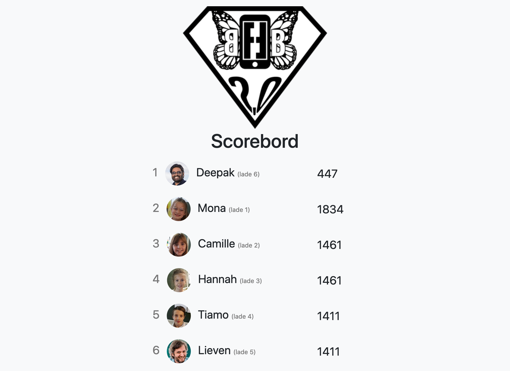
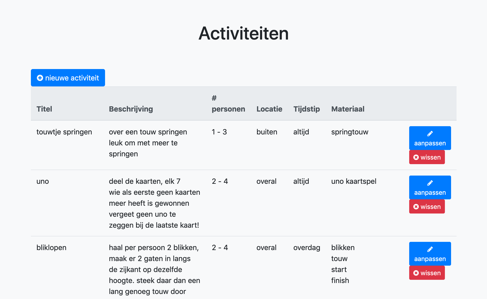
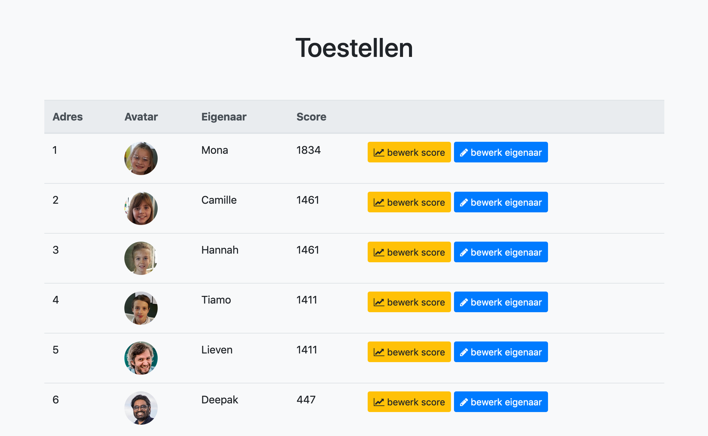
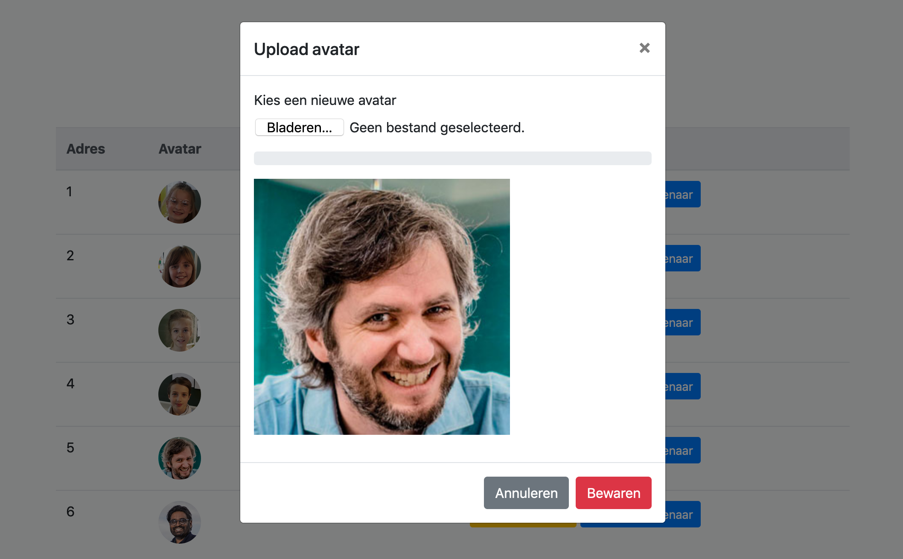
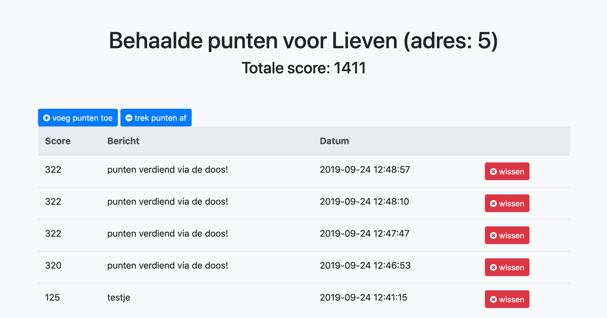
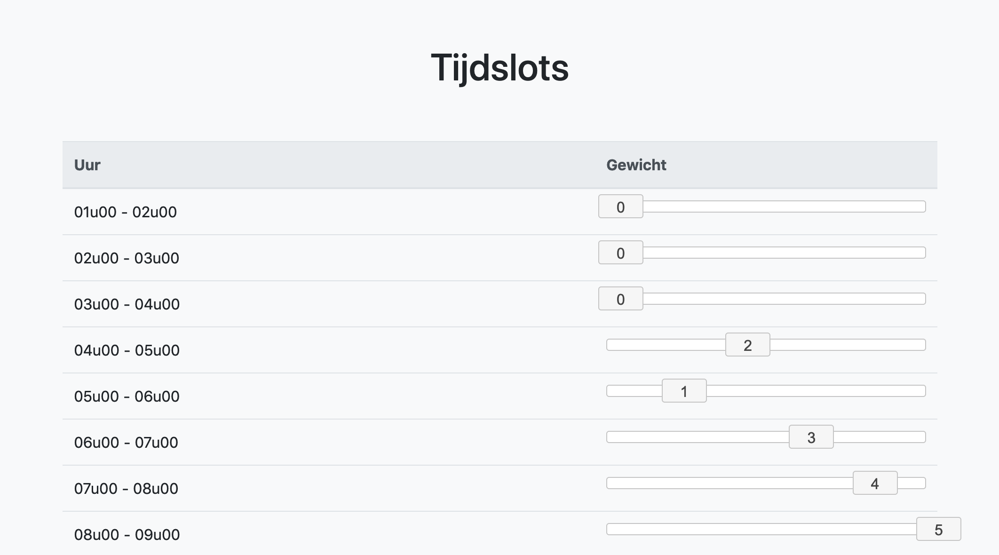

# Fast Friends Box - de handleiding

## Verbinding maken via wifi

Als de fast friends box opgestart is, creëert hij een wifi hotspot.

Je kan hier mee verbinden met wachtwoord *teamscheire*.

## Scorebord

Als je met de wifi van de doos verbonden bent, kan je surfen naar het scorebord.

Het adres waar je naar moet surfen is: [http://fastfriendsbox.local](http://fastfriendsbox.local)

## Beheren van de activiteiten

Surf naar [http://fastfriendsbox.local/admin/activiteit.html](http://fastfriendsbox.local/admin/activiteit.html) en je kan activiteiten aanpassen, verwijderen of toevoegen.

Het aantal personen is belangrijk om te bepalen wanneer een activteit door de doos gekozen wordt. Het aantal gsm's dat op dat moment in de doos zit, moet tussen het minimum en maximum aantal liggen van de activiteit.

## Beheren van de personen (via lades)

Surf naar [http://fastfriendsbox.local/admin/toestel.html](http://fastfriendsbox.local/admin/toestel.html) en je kan de namen van de personen en hun lade aanpassen, de profielfoto's wijzigen en punten aanpassen.

### Profielfoto's aanpassen

Klik op de foto van een persoon en je krijgt een scherm om een nieuwe profielfoto te uploaden.

### Score aanpassen

Klik voor een persoon 'bewerk score'. Je moet nu een extra wachtwoord invullen: *teamscheire* Je krijgt nu een extra scherm waar je punten kan toevoegen, minpunten kan geven of scores kan wissen.

## Beheren van de tijdslots

Achter de schermen is er een extra mogelijkheid om per uur te bepalen of er meer of minder punten verdiend kunnen worden als een gsm in de doos zit. Dit gebeurt door per uur een gewicht toe te kennen.

Een gewicht van 0 wil zeggen dat er tijdens dit uur geen punten verdiend worden. Handig bijvoorbeeld voor 's nachts als het niet uit maakt of de gsm in de doos ligt of niet. 

Een gewicht van 5 wil zeggen dat er heel veel punten kunnen verdiend worden tijdens dit uur. Handig voor de piekuren om extra te motiveren om tijdens die uren de gsm in de doos te leggen.