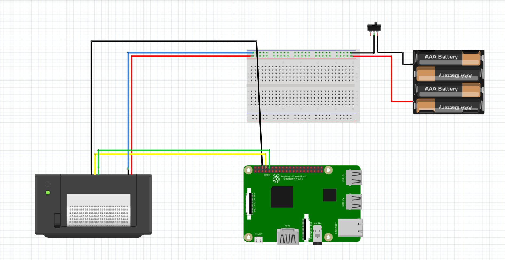
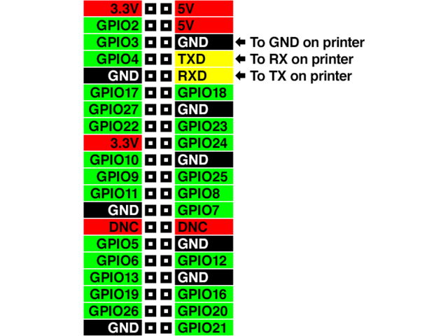

## Download en installeer de raspbian versie naar keuze.

Via [https://www.raspberrypi.org/downloads/raspbian/](https://www.raspberrypi.org/downloads/raspbian)

## Configureren van SD-card

Op je eigen laptop. 
De commando's zijn voor mac/linux.

Alles in de root folder van de SD-kaart

```
cd /Volumes/boot
```

### SSH aanzetten

In de rootpartitie van de sd-card:

```
touch ssh
```

### Wifi instellen

```
vim wpa_supplicant.conf
```

For Raspbian:
Enter the ssid and passphrase for the wifi

```
ctrl_interface=DIR=/var/run/wpa_supplicant GROUP=netdev
network={
    ssid="xxxxx"
    psk="xxxxx"
    key_mgmt=WPA-PSK
}
```

## Config on raspi

Nadat je raspberry pi is opgestart, ga je ermee verbinden

```
ssh pi@raspberry.local
```

Het standaard wachtwoord is *raspberry*

### raspi-config

```
sudo raspi-config
```

Expand Filesystem
Change hostname
Set Timezone

reboot

### Update filesystem

```
sudo apt-get update && sudo apt-get -y upgrade
```

## nodejs + SQLite

```
sudo -s
curl -sL https://deb.nodesource.com/setup_11.x | bash -
apt-get install -y nodejs sqlite3
```

[https://dev.to/bogdaaamn/run-your-nodejs-application-on-a-headless-raspberry-pi-4jnn](https://dev.to/bogdaaamn/run-your-nodejs-application-on-a-headless-raspberry-pi-4jnn)

## nginx

```
sudo apt-get install -y nodejs
```

```
sudo vim /etc/nginx/sites-available/default

server {
        listen 80;
        listen [::]:80;

        server_name schermtijd01.local;

        root /var/www/;
        index index.html;

        location / {
            proxy_pass http://localhost:3000;
            proxy_http_version 1.1;
            proxy_set_header Upgrade $http_upgrade;
            proxy_set_header Connection 'upgrade';
            proxy_set_header Host $host;
            proxy_cache_bypass $http_upgrade;
        }
}
```

```
sudo systemctl start nginx

```

## Thermal printer

Het is deze [https://www.adafruit.com/product/2751](https://www.adafruit.com/product/2751)
Met een volledige handleiding en meer bronnen, [https://learn.adafruit.com/mini-thermal-receipt-printer](hier)

### Draadjes aansluiten

- RX van de printer naar TX van de raspi
- TX van de printer naar RX van de raspi
- GND van de printer naar GND van de raspi

De printer stroom geven (minimaal 1.5A 5v - 9v) via het ander poortje





### activeren over TTL

Eerst configureren sodat we de seriale bus kunnen gebruiken

```
sudo raspi-config
```

Interfacing options > disable the serial console > enable the serial port hardware.

Na reboot, een eerste test:

```
stty -F /dev/ttyS0 9600
echo -e "\\n\\nHallo printertje.\\n\\n\\n" > /dev/ttyS0
```

## LED displays

I2C-bus activeren:
[https://learn.adafruit.com/adafruits-raspberry-pi-lesson-4-gpio-setup/configuring-i2c](https://learn.adafruit.com/adafruits-raspberry-pi-lesson-4-gpio-setup/configuring-i2c)

Aansluitingen:
[https://learn.adafruit.com/led-backpack-displays-on-raspberry-pi-and-beaglebone-black/wiring](https://learn.adafruit.com/led-backpack-displays-on-raspberry-pi-and-beaglebone-black/wiring)

python library:
[https://github.com/adafruit/Adafruit_Python_LED_Backpack](https://github.com/adafruit/Adafruit_Python_LED_Backpack)