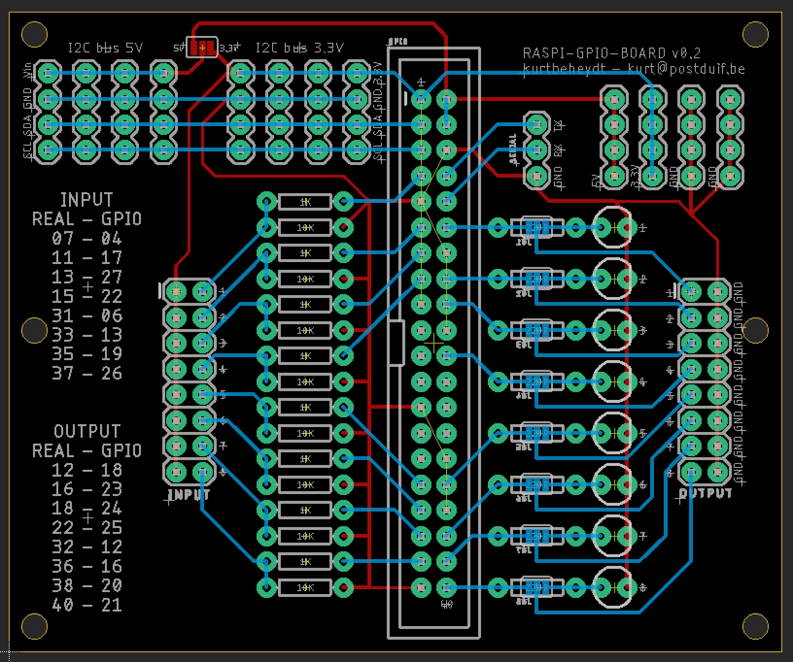

## Download en installeer de raspbian versie naar keuze.

Via [https://www.raspberrypi.org/downloads/raspbian/](https://www.raspberrypi.org/downloads/raspbian)

## Configureren van SD-card

Op je eigen laptop. 
De commando's zijn voor mac/linux.

Alles in de root folder van de SD-kaart

```
cd /Volumes/boot
```

### SSH aanzetten

In de rootpartitie van de sd-card:

```
touch ssh
```

### Wifi instellen

```
vim wpa_supplicant.conf
```

For Raspbian:
Enter the ssid and passphrase for the wifi

```
ctrl_interface=DIR=/var/run/wpa_supplicant GROUP=netdev
network={
    ssid="xxxxx"
    psk="xxxxx"
    key_mgmt=WPA-PSK
}
```

## Config on raspi

Nadat je raspberry pi is opgestart, ga je ermee verbinden

```
ssh pi@raspberry.local
```

Het standaard wachtwoord is *raspberry*

### Update filesystem

```
sudo apt-get update && sudo apt-get -y upgrade
```

### raspi-config

```
sudo raspi-config
```

- Expand Filesystem
- Change hostname
- Set Timezone

reboot

## nodejs + SQLite

Het scorebord en de activiteiten zitten in een SQLite database met een api errond, geschreven in node.js

```
sudo -s
curl -sL https://deb.nodesource.com/setup_11.x | bash -
exit
sudo apt-get install -y nodejs sqlite3
```

meer info op [https://dev.to/bogdaaamn/run-your-nodejs-application-on-a-headless-raspberry-pi-4jnn](https://dev.to/bogdaaamn/run-your-nodejs-application-on-a-headless-raspberry-pi-4jnn)


## Activeren/installeren van de api en frontend

In de folder van de nodejs server alle requirements installeren:

```
cd src
npm install
```

De api starten

```
nodejs server.js
```

## automatisch starten en uitvoeren in de achtergrond van de server

Om de nodejs server als service te laten draaien (te daemonizen zoals ze zeggen) kan je pm2 gebruiken.

```
sudo npm install pm2 -g
```

In plaats van de server te starten via het `nodejs` commando, doe je dit nu via:

```
pm2 start server.js --watch
pm2 startup
sudo env PATH=$PATH:/usr/bin /usr/lib/node_modules/pm2/bin/pm2 startup systemd -u pi --hp /home/pi
```

De server draait nu als een service.

Je kan de status bekijken of de service stoppen of opnieuw starten via volgende commando's:

```
pm2 list
pm2 stop 0
pm2 start 0
```

## nginx

Het scorebord draait op een webserver op je raspberry pi, hiervoor moet nginx draaien zodat je het vlot via eender welke browser kan bekijken (zolang die op hetzelfde wifi netwerk verbonden is als je raspberry pi).

```
sudo apt-get install -y nginx
```

configureren van je site:

```
sudo rm /etc/nginx/sites-available/default
sudo nano /etc/nginx/sites-available/default

server {
        listen 80;
        listen [::]:80;

        server_name schermtijd01.local;

        root /var/www/;
        index index.html;

        location / {
            proxy_pass http://localhost:3000;
            proxy_http_version 1.1;
            proxy_set_header Upgrade $http_upgrade;
            proxy_set_header Connection 'upgrade';
            proxy_set_header Host $host;
            proxy_cache_bypass $http_upgrade;
        }
}
```

(Her)start de webservice hierna:

```
sudo systemctl restart nginx

```

Nu kan je van eender welk toestel dat op hetzelfde netwerk zit als je raspberry pi surfen naar  [http://schermtijd01.local](http://schermtijd01.local) om het scorebord te zien.


## Thermal printer

Het is deze [https://www.adafruit.com/product/2751](https://www.adafruit.com/product/2751)

Een volledige handleiding en meer bronnen, [https://learn.adafruit.com/mini-thermal-receipt-printer](hier)

### Draadjes aansluiten

- RX van de printer naar TX van de raspi
- TX van de printer naar RX van de raspi
- GND van de printer naar GND van de raspi

De printer stroom geven (minimaal 1.5A 5v - 9v) via het andere adaptor. De printer trekt veel ampère en dit delen met de raspberry pi is geen goed plan ...


### activeren over TTL

Eerst configureren zodat we de seriale bus kunnen gebruiken

```
sudo raspi-config
```

Interfacing options > disable the serial console > enable the serial port hardware.

Na reboot, een eerste test:

```
stty -F /dev/ttyS0 9600
echo -e "\\n\\nHallo printertje.\\n\\n\\n" > /dev/ttyS0
```

### repo voor node.js

Om de printer te gebruiken in Node.js, wordt deze library gebruikt: [https://github.com/xseignard/thermalPrinter](https://github.com/xseignard/thermalPrinter).

Via `npm install` heb je deze requirement normaal gezien al geïnstalleerd.


## LED displays


I2C is een protocol waarbij je tot 8 elementen in een bus kan koppelen aan één seriele bus.
Je moet dit protocol eerst activeren op de raspberry pi via raspi-config:

```
sudo raspi-config
```

Daar kies je Interfacing options > I2C > enable (yes)

Voor Python moeten wat paketten/drivers geïnstalleerd worden:

```
sudo apt-get install -y python-smbus i2c-tools build-essential python-dev git python-pil python-pip
git clone https://github.com/adafruit/Adafruit_Python_LED_Backpack.git # voor de 7-segment en de 8x8 matrix
cd Adafruit_Python_LED_Backpack
sudo python setup.py install
cd ..
git clone https://github.com/adafruit/Adafruit_Python_SSD1306.git # voor de oled
cd Adafruit_Python_SSD1306/
sudo python setup.py install

```

Hierna kan je de displays aansluiten en via het volgende commando de adressen checken:

```
sudo i2cdetect -y 1
```


Je krijgt iets in deze aard:

```
pi@schermtijd01:~ $ i2cdetect -y 1
     0  1  2  3  4  5  6  7  8  9  a  b  c  d  e  f
00:          -- -- -- -- -- -- -- -- -- -- -- -- --
10: -- -- -- -- -- -- -- -- -- -- -- -- -- -- -- --
20: -- -- -- -- -- -- -- -- -- -- -- -- -- -- -- --
30: -- -- -- -- -- -- -- -- -- -- -- -- 3c -- -- --
40: -- -- -- -- -- -- -- -- -- -- -- -- -- -- -- --
50: -- -- -- -- -- -- -- -- -- -- -- -- -- -- -- --
60: -- -- -- -- -- -- -- -- -- -- -- -- -- -- -- --
70: 70 71 72 -- -- -- -- --
```

Adres 70, 71 en 3c zijn ingebruik


### 7-segment display

### 8X8 matrix

### oled SSD1306
[Dit oled display wordt gebruikt](https://www.ebay.com/itm/IIC-I2C-0-91-128x32-White-OLED-LCD-Display-Module-DC-3-3V-5V-For-Arduino-PIC/332047978840).


Nog python packet requests installeren om api calls te kunnen doen:

```
pip install requests
```

Starten van python app:

```
python gpio/app.py
```

Stappen staan hier:
[https://learn.adafruit.com/adafruits-raspberry-pi-lesson-4-gpio-setup/configuring-i2c](https://learn.adafruit.com/adafruits-raspberry-pi-lesson-4-gpio-setup/configuring-i2c)

Aansluitingen:
[https://learn.adafruit.com/led-backpack-displays-on-raspberry-pi-and-beaglebone-black/wiring](https://learn.adafruit.com/led-backpack-displays-on-raspberry-pi-and-beaglebone-black/wiring)

python library:
[https://github.com/adafruit/Adafruit_Python_LED_Backpack](https://github.com/adafruit/Adafruit_Python_LED_Backpack)

## PCB voor de doos


